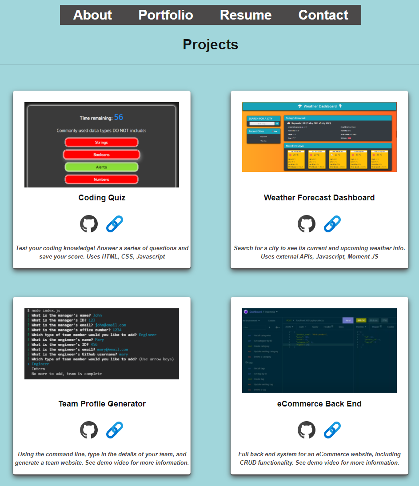

# Portfolio built using React

Link to the deployed application: https://raven-bootcamp.github.io/portfolio-react

Link to the code repository: https://github.com/raven-bootcamp/portfolio-react

## Table of Contents
- [The Task](#the-task)
- [Instructions for Use](#instructions-for-use)
- [Technologies Used](#technologies-used)
- [Screenshot](#screenshots)

## The Task
During the full stack bootcamp course, we have been required to build a personal portfolio of work on three separate occasions.  This is the third such instance, and this time we are required to build our portfolio in React JS.

## Instructions for Use
It is assumed that you have checked out the repository to your local machine, using Git.

Firstly, install the required node libraries:
```
npm install
```
Installing the libraries may take a few minutes.

Once completed, you can use the following command to compile and run the application (it should open automatically in your web browser):
```
npm run start
```
If making changes, edit any files necessary.  Once any development is complete, deploy the new application using the following command:
```
npm run deploy
```
This will compile and build any required static files, and push it to a Git branch specifically for use in Github Pages.  Changes are automatically pushed.  You can find the link to the deployed application at the top of this README file, or in your `package.json` file under the heading `homepage`.

## Technologies Used
- [Node.js](https://nodejs.org/en/)
- [React](https://reactjs.org/) - a Javascript library developed by Facebook engineers
- [Bootstrap](https://getbootstrap.com/) - a CSS framework
- [gh-pages](https://www.npmjs.com/package/gh-pages) - an NPM library that allows an application to be easily deployed to Github Pages

## Screenshot
